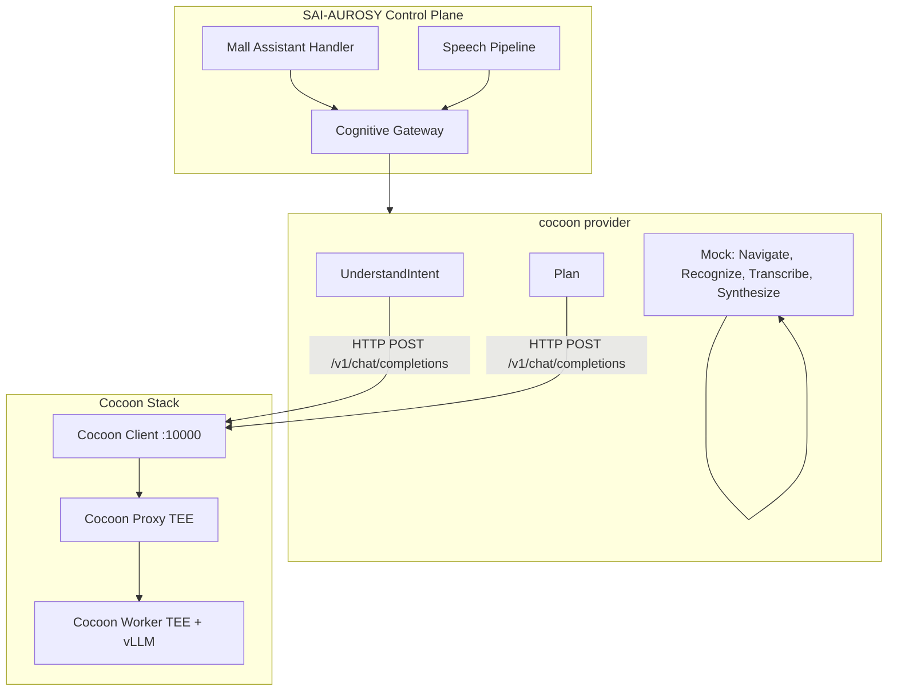

# Cocoon Integration

## Overview

The **cocoon** provider routes LLM-based Cognitive Gateway capabilities (UnderstandIntent, Plan) to [Cocoon](https://github.com/TelegramMessenger/cocoon) — a decentralized AI inference platform that runs models in Intel TDX Trusted Execution Environments (TEE). Prompts and responses are processed in isolated environments; GPU owners cannot access user data.

## Architecture



## Capabilities

| Capability | Cocoon provider | Notes |
|------------|-----------------|-------|
| UnderstandIntent | Yes | LLM inference via chat completions |
| Plan | Yes | LLM inference via chat completions |
| Navigate | No | Uses mock (Mall Digital Twin handles routes) |
| Recognize | No | Uses mock (Cocoon focuses on text LLMs) |
| Transcribe | No | Uses mock (STT requires external service) |
| Synthesize | No | Uses mock (TTS requires external service) |

## Configuration

### Environment Variables

| Variable | Default | Description |
|----------|---------|-------------|
| `COGNITIVE_PROVIDER` | `mock` | Set to `cocoon` to enable |
| `COGNITIVE_COCOON_CLIENT_URL` | `http://localhost:10000` | Base URL of Cocoon client |
| `COGNITIVE_COCOON_MODEL` | `Qwen/Qwen3-32B` | Model name (must match Cocoon workers) |
| `COGNITIVE_COCOON_TIMEOUT_SEC` | `30` | Request timeout in seconds |
| `COGNITIVE_COCOON_MAX_TOKENS` | `512` | Max tokens per request |

### Config File

JSON config (when `COGNITIVE_CONFIG_PATH` is set):

```json
{
  "provider": "cocoon",
  "cocoon": {
    "client_url": "http://cocoon-client:10000",
    "model": "Qwen/Qwen3-32B",
    "timeout_sec": 30,
    "max_tokens": 512
  }
}
```

### Model Options

- `Qwen/Qwen3-32B` — Latest Qwen3, best quality (requires H100-class GPU on Cocoon workers)
- `Qwen/Qwen3-8B` — Smaller, faster (Cocoon benchmark default)

## Deployment

### Prerequisites

1. **Cocoon client** — Build from [cocoon repo](https://github.com/TelegramMessenger/cocoon) or use future Docker image. The client exposes HTTP API at `http://host:10000/v1/chat/completions` (OpenAI-compatible).

2. **TON wallet and config** — Cocoon uses TON blockchain for payments. Configure the client with wallet and network config.

3. **Cocoon workers** — Must serve the configured model. Workers can be run by the Cocoon network or self-hosted. Build model with `./scripts/build-model Qwen/Qwen3-32B` if running own workers.

### Docker Compose

Use the optional override:

```bash
docker compose -f docker-compose.yml -f docker-compose.cocoon.yml up -d
```

This sets `COGNITIVE_PROVIDER=cocoon` and `COGNITIVE_COCOON_CLIENT_URL=http://host.docker.internal:10000`. Run Cocoon client on the host separately.

### Local Development

1. Start Cocoon client (build from source).
2. Set environment:

   ```bash
   export COGNITIVE_PROVIDER=cocoon
   export COGNITIVE_COCOON_CLIENT_URL=http://localhost:10000
   export COGNITIVE_COCOON_MODEL=Qwen/Qwen3-8B
   ```

3. Run Control Plane: `go run ./cmd/control-plane`

## Testing with fake-ton

To verify the Cocoon integration without real TON blockchain, use fake-ton mode.

### Setup

See [Cocoon Test Setup](../../scripts/cocoon-test-setup.md) for full instructions.

| Mode | Command | Requirements | LLM inference |
|------|---------|--------------|---------------|
| **Local-all** | `./scripts/cocoon-launch --local-all` | Linux, Cocoon built from source | Fake HTTP backend (protocol test only) |
| **Test + fake-ton** | proxy + worker + client with `--test --fake-ton` | Intel TDX, NVIDIA GPU (H100+), QEMU | Real vLLM in TEE |

### Model

For fake-ton test configs, use **Qwen/Qwen3-0.6B** (matches Cocoon `scripts/client.conf`):

```bash
export COGNITIVE_COCOON_MODEL=Qwen/Qwen3-0.6B
```

Or use the test override:

```bash
docker compose -f docker-compose.yml -f docker-compose.cocoon-test.yml up -d
```

### Verification

Run the verification script:

```bash
./scripts/verify-cocoon-integration.sh
```

With `--start` to launch the stack automatically:

```bash
./scripts/verify-cocoon-integration.sh --start
```

## Security Properties

- **TEE isolation** — Prompts and responses are processed inside TDX VMs; host cannot access them.
- **Model verification** — Clients can verify workers use the correct model via dm-verity hashes.
- **RA-TLS** — All connections use TLS with remote attestation.

## Related Documents

- [Cognitive Gateway](cognitive-gateway.md)
- [Phase 3.2 Cognitive Gateway](../implementation/phase-3.2-cognitive-gateway.md)
- [Cocoon](https://github.com/TelegramMessenger/cocoon)
