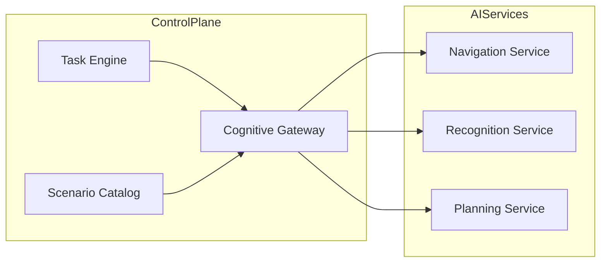

# Cognitive Gateway

## Overview

The Cognitive Gateway is an abstraction layer for AI services used by the SAI AUROSY platform. It provides navigation, recognition, and planning capabilities that can be invoked by scenarios and tasks.

## Architecture



## Services

| Service | Purpose | Example Use |
|---------|---------|-------------|
| **Navigation** | Path planning, route computation | `navigation` scenario — build route from map |
| **Recognition** | Object/person detection | Obstacle detection, person detection |
| **Planning** | Task/action planning | Choose sequence of operations |

## Interface

The `Gateway` interface in `pkg/control-plane/cognitive/gateway.go` defines:

- `Navigate(ctx, req) (*NavigateResult, error)` — compute path from A to B
- `Recognize(ctx, req) (*RecognizeResult, error)` — detect objects in sensor data
- `Plan(ctx, req) (*PlanResult, error)` — generate step sequence for a task type
- `Transcribe(ctx, req) (*TranscribeResult, error)` — speech-to-text (STT)
- `Synthesize(ctx, req) (*SynthesizeResult, error)` — text-to-speech (TTS)
- `UnderstandIntent(ctx, req) (*IntentResult, error)` — extract intent from user text

## Speech Layer

The Cognitive Gateway includes a Speech Layer for voice-enabled robots. It supports multilingual conversations (uz, en, ru, az, ar) and integrates with a separate Conversation Catalog for intent-to-response mapping. See [Speech Layer](speech-layer.md) and [Phase 3.5](../implementation/phase-3.5-speech-layer.md).

## Providers

- **mock** — no-op provider returning empty/mock results. Default when no external AI is configured.
- **http** — calls external AI services via REST. Configure per-capability URLs; add new AI backends without code changes.

## Plugin Model

Providers are selected via configuration (env or config file). No code changes required to switch providers or add new AI services.

| Variable | Purpose |
|----------|---------|
| `COGNITIVE_PROVIDER` | Provider name: `mock` (default) or `http` |
| `COGNITIVE_HTTP_NAV_URL` | Navigation service base URL |
| `COGNITIVE_HTTP_RECOGNIZE_URL` | Recognition service base URL |
| `COGNITIVE_HTTP_PLAN_URL` | Planning service base URL |
| `COGNITIVE_HTTP_TRANSCRIBE_URL` | STT service base URL |
| `COGNITIVE_HTTP_SYNTHESIZE_URL` | TTS service base URL |
| `COGNITIVE_HTTP_INTENT_URL` | Intent extraction service base URL |
| `COGNITIVE_HTTP_API_KEY` | Optional API key (Bearer header) |
| `COGNITIVE_CONFIG_PATH` | Optional JSON config file path (overrides env) |

Config file format (when `COGNITIVE_CONFIG_PATH` is set):

```json
{
  "provider": "http",
  "http": {
    "navigate_url": "http://nav-service:8080/navigate",
    "recognize_url": "http://vision-api:5000/detect",
    "plan_url": "http://planner:8000/plan",
    "api_key_env": "COGNITIVE_HTTP_API_KEY"
  }
}
```

HTTP contract: POST with JSON body, JSON response. Each URL can point to a different vendor (ROS nav, vision API, LLM planner).

## API Endpoints

- `POST /v1/cognitive/navigate` — navigation request
- `POST /v1/cognitive/recognize` — recognition request
- `POST /v1/cognitive/plan` — planning request
- `POST /v1/cognitive/transcribe` — speech-to-text
- `POST /v1/cognitive/synthesize` — text-to-speech
- `POST /v1/cognitive/understand-intent` — intent extraction

All endpoints require authentication and respect tenant isolation (operator sees only tenant robots).

## Related Documents

- [Platform Architecture](platform-architecture.md)
- [Speech Layer](speech-layer.md)
- [Phase 3.2 Cognitive Gateway](../implementation/phase-3.2-cognitive-gateway.md)
- [Phase 3.5 Speech Layer](../implementation/phase-3.5-speech-layer.md)
