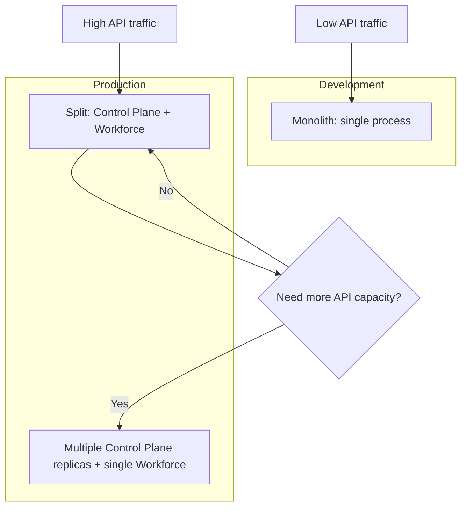

# Control Plane and Workforce Split

## Overview

For scaling, the platform can run Control Plane and Workforce as separate services. They share the same database and NATS.

## Architecture

```
┌─────────────────────────────────────────────────────────────┐
│                    Control Plane Service                     │
│  API Gateway | Auth | Registry | Streaming | Cognitive       │
│  Edges | Health | Tasks/Workflows API (writes to DB)         │
└─────────────────────────────────────────────────────────────┘
                              │
                    ┌─────────┴─────────┐
                    │                   │
                    ▼                   ▼
              ┌──────────┐        ┌──────────┐
              │   NATS   │        │ Database │
              └──────────┘        └──────────┘
                    │                   │
                    └─────────┬─────────┘
                              │
┌─────────────────────────────────────────────────────────────┐
│                    Workforce Service                         │
│  Task Runner | Analytics Consumer | Webhook Dispatcher       │
│  Robot Online Watcher | Telemetry Retention                  │
└─────────────────────────────────────────────────────────────┘
```

## Deployment

### Monolith (default)

Run only the Control Plane. It embeds all Workforce components.

```bash
go run ./cmd/control-plane
```

### Split mode

1. **Control Plane** with `WORKFORCE_REMOTE=true`:

```bash
WORKFORCE_REMOTE=true go run ./cmd/control-plane
```

2. **Workforce** (separate process):

```bash
REGISTRY_DB_DRIVER=postgres REGISTRY_DB_DSN="..." go run ./cmd/workforce
```

Both must use the same `REGISTRY_DB_DSN` and `NATS_URL`.

**Docker Compose (split mode)**: Use the override file to run Control Plane and Workforce as separate containers with a shared PostgreSQL database:

```bash
docker compose -f docker-compose.yml -f docker-compose.split.yml up -d
```

This starts `postgres`, `control-plane` (with `WORKFORCE_REMOTE=true`), `workforce`, plus `nats`, adapters, and operator-console from the base compose.

## Data flow

- **Tasks**: Control Plane API `POST /v1/tasks` writes to `tasks` table. Workforce task runner polls and executes.
- **Workflows**: Control Plane API `POST /v1/workflows/{id}/run` creates workflow run and tasks in DB. Workforce task runner picks up tasks.
- **Telemetry**: Adapters publish to NATS. Workforce consumes and writes to `telemetry_samples`.
- **Webhooks**: Workforce dispatches task-related events. Control Plane dispatches API-triggered events (e.g. `safe_stop`).

## Configuration

| Variable | Control Plane | Workforce |
|----------|---------------|-----------|
| `WORKFORCE_REMOTE` | `true` = don't run workforce components | N/A |
| `REGISTRY_DB_DRIVER` | Required for persistence | Required |
| `REGISTRY_DB_DSN` | Same as Workforce | Same as Control Plane |
| `NATS_URL` | Same as Workforce | Same as Control Plane |
| `WORKFORCE_ADDR` | N/A | Health server address (default `:9090`) |
| `SHUTDOWN_TIMEOUT` | HTTP drain timeout in seconds (default 30) | N/A |
| `SHUTDOWN_GRACE_SECONDS` | N/A | Grace period before cancel on SIGTERM (default 25) |

## Health Endpoints

**Control Plane** exposes `/health` and `/ready` on its main HTTP port (default 8080).

**Workforce** exposes `/health` and `/ready` on a dedicated health port (default 9090):

| Endpoint | Purpose |
|----------|---------|
| `GET /health` | Liveness — process is alive |
| `GET /ready` | Readiness — NATS connected, DB reachable |

Use these for Kubernetes liveness/readiness probes and Docker Swarm healthchecks. See [Production Runbook](../operations/production-runbook.md) for probe configuration.

## Graceful Shutdown

Both services handle SIGTERM/SIGINT for clean shutdown:

- **Control Plane**: Drains in-flight HTTP requests (up to `SHUTDOWN_TIMEOUT` seconds), then stops background goroutines.
- **Workforce**: Waits `SHUTDOWN_GRACE_SECONDS` to allow in-flight tasks to reach their next checkpoint. The task runner cancels active tasks (updates status to Cancelled, sends safe_stop, releases zones) before exiting. See [Graceful Shutdown](../operations/graceful-shutdown.md).

## Scaling Scenarios

### Scenario 1: Monolith (default)

Single Control Plane process with embedded Workforce. Best for development and small deployments.

- **Use when**: Local development, demos, low task volume
- **Command**: `go run ./cmd/control-plane`

### Scenario 2: Split, single Workforce (recommended for production)

Control Plane and Workforce run as separate processes. Control Plane handles all HTTP traffic; Workforce runs task execution, analytics, webhooks, and telemetry retention.

- **Use when**: Production, need to scale API independently from task processing
- **Control Plane**: `WORKFORCE_REMOTE=true go run ./cmd/control-plane`
- **Workforce**: `REGISTRY_DB_DRIVER=postgres REGISTRY_DB_DSN="..." go run ./cmd/workforce`

### Scenario 3: Control Plane horizontal scaling

Multiple Control Plane replicas behind a load balancer, single Workforce. The Control Plane is stateless (API, auth, registry, streaming); only one Workforce instance should run.

- **Use when**: High API traffic, need to scale HTTP layer
- **Setup**: Run 2+ Control Plane replicas with `WORKFORCE_REMOTE=true`; run one Workforce; share `REGISTRY_DB_DSN` and `NATS_URL`

### Scenario 4: Multiple Workforce instances (not yet supported)

Running multiple Workforce instances for higher task throughput is **not supported** in the current implementation. Limitations:

| Component | Issue |
|-----------|-------|
| Task Runner | No claim pattern; two workers can pick the same task (race condition) |
| Coordinator | In-memory per process; zone locks not shared across instances |
| Telemetry Consumer | Plain NATS subscribe; each instance receives all messages → duplicate writes |
| Webhook Dispatcher | Duplicate events possible if task race occurs |
| Robot Online Watcher | Same subscription pattern → duplicate webhook events |

**Future work** to support multiple Workforce instances would require:

- **Task store**: Claim pattern (e.g. `UPDATE tasks SET status='running', claimed_by=? WHERE id=? AND status='pending'`)
- **Coordinator**: Shared store (DB or Redis) for zone locks
- **Telemetry**: NATS `QueueSubscribe` with queue group for analytics consumer
- **Webhooks / Robot Online**: Same queue subscription pattern

### Scaling decision flow



## Related

- [Platform Architecture](platform-architecture.md)
- [Deployment Model](deployment-model.md)
