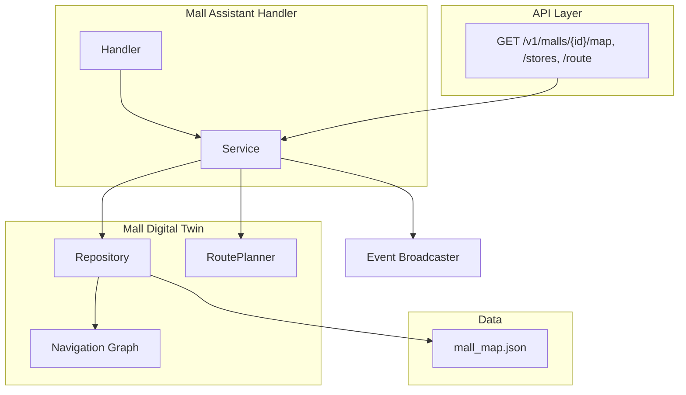

# Mall Digital Twin Architecture

## Overview

The Mall Digital Twin is a lightweight platform module that provides location intelligence for the Mall Assistant scenario. It models a shopping mall as a navigation graph with nodes (points of interest) and edges (walkable routes), enabling route planning from the robot standby point to target stores.

## Architecture



## Domain Model

### MallMap

- **ID** — mall identifier (e.g. `default`)
- **Name** — display name
- **Floors** — floor levels
- **Nodes** — navigation graph vertices (stores, entrance, standby, elevator, etc.)
- **Edges** — walkable routes between nodes with distance
- **Stores** — store-to-node mapping (StoreLocation)
- **BasePoint** — node ID for robot standby/base

### NavNode

- **ID** — unique node identifier
- **Name** — display name
- **FloorID** — floor reference
- **Zone** — zone label (A, B, C)
- **Coordinates** — X, Y position
- **Type** — `store`, `entrance`, `standby`, `elevator`, `escalator`, `info_desk`, `junction`

### NavEdge

- **From**, **To** — node IDs
- **Distance** — edge weight (meters or arbitrary units)
- **Bidirectional** — whether the path can be traversed both ways

### StoreLocation

- **StoreName** — canonical store name
- **FloorID**, **Zone** — location metadata
- **NodeID** — navigation node for the store

## Components

### Repository (`internal/mall/repository.go`)

- **Repository** interface: `GetMap(ctx, mallID) (*MallMap, error)`
- **MemoryRepository** — loads from JSON file, holds maps in memory
- Designed for future Postgres-backed implementation

### Navigation Graph (`internal/mall/navigation.go`)

- **Graph** — adjacency list built from nodes and edges
- **ShortestPath(from, to)** — Dijkstra algorithm
- Bidirectional edges add both directions

### Route Planner (`internal/mall/routes.go`)

- **RoutePlanner** — uses repository and graph
- **CalculateRoute(ctx, mallID, from, to)** — returns ordered NavNodes and total distance

### Service (`internal/mall/service.go`)

- **GetMallMap** — full map
- **FindStoreNode** — store name → NavNode (fuzzy match)
- **GetBasePoint** — standby node
- **CalculateRoute** — shortest path between nodes
- **ListStores** — all store locations

## API Contract

| Method | Path | Response |
|--------|------|----------|
| GET | `/v1/malls/{mall_id}/map` | `{ id, name, floors, nodes, edges, stores, base_point }` |
| GET | `/v1/malls/{mall_id}/stores` | `[{ store_name, floor_id, zone, node_id }]` |
| GET | `/v1/malls/{mall_id}/stores/{store_name}` | `{ store_name, floor_id, zone, node }` |
| GET | `/v1/malls/{mall_id}/route?from={node_id}&to={node_id}` | `{ route: [NavNode], estimated_distance }` |

All endpoints require authentication (Operator, Administrator, or Viewer role).

## Task Payload Extension

The `navigate_to_store` task payload includes:

```json
{
  "mall_id": "default",
  "target_store": "Nike",
  "destination_node_id": "node-nike",
  "route": ["node-standby", "node-info", "node-junction-a", "node-nike"],
  "estimated_distance": 21.2,
  "target_coordinates": "15.00,5.00,0"
}
```

- **target_coordinates** — for adapter compatibility (X,Y,Z string)
- **route** — ordered node IDs for future waypoint-based navigation

## Mall Map Data

Example map: `scenarios/data/mall_map.json`

- One floor, zones A, B, C
- Nodes: entrance, standby (base), Nike, Adidas, Apple Store, Food Court, Elevator, Escalator, Information Desk, junctions
- Edges: walkable paths with distances
- Stores: Nike, Adidas, Apple Store, Food Court, Electronics Zone (→ Apple Store)

## Events

| Event | Payload |
|-------|---------|
| `mall_store_resolved` | mall_id, store_name, node_id |
| `mall_route_calculated` | mall_id, from_node, to_node, route_length, estimated_distance |
| `mall_navigation_requested` | mall_id, robot_id, store_name, from_node, to_node, route_length, estimated_distance |

## Constraints

- No SLAM or real localization
- In-memory repository; Postgres-ready interface
- Single mall for pilot; API supports multi-mall
- One robot, one base point
- Route planning is graph-based; adapters may use target_coordinates for actual navigation

## Related Documents

- [Mall Assistant Scenario](../implementation/mall-assistant-scenario.md)
- [Platform Architecture](platform-architecture.md)
