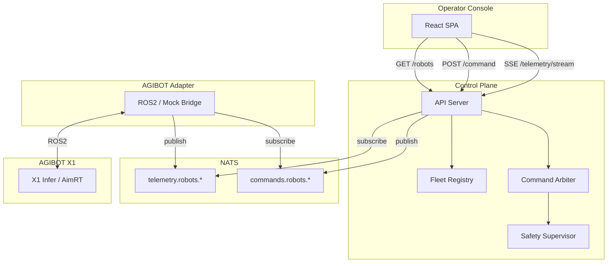

# MVP V1 Architecture

Архитектура минимального сценария «Status + Safe Stop».

## Diagram

## Data Flow

### Telemetry
1. X1 Infer публикует `/joint_states`, `/imu/data` в ROS2
2. AGIBOT Adapter подписывается, маппит в нормализованную телеметрию
3. Adapter публикует в NATS `telemetry.robots.x1-001`
4. Control Plane подписан на `telemetry.robots.>`, стримит в SSE
5. Operator Console получает SSE, обновляет UI

### Safe Stop
1. Оператор нажимает Safe Stop в Console
2. Console: POST /robots/x1-001/command { "command": "safe_stop" }
3. API → Safety Supervisor (allow) → Publish в NATS `commands.robots.x1-001`
4. AGIBOT Adapter получает, публикует в ROS2 `/start_control`
5. X1 Infer RL Control переводит робота в idle
