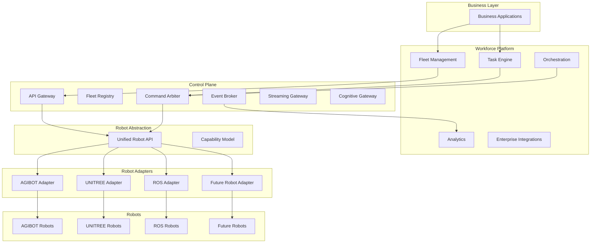

# Platform Architecture

## Overview

SAI-AUROSY — многослойная платформа для управления роботизированным флотом. Архитектура построена по принципу разделения ответственности: бизнес-приложения взаимодействуют с платформой Workforce, которая через Control Plane и Robot Abstraction управляет разнородными роботами через адаптеры.

## Architecture Scheme

```
┌──────────────────────────────────────────────────────────────┐
│                    Business Applications                     │
│ Mall assistant | Security | Cleaning | Logistics | Museum   │
└──────────────────────────────────────────────────────────────┘
                              │
┌──────────────────────────────────────────────────────────────┐
│                SAI Workforce / Enterprise Layer             │
│ Fleet Mgmt | Task/Scenario Engine | Analytics | Integrations│
│ Orchestration | Operator Console | Audit | Tenant Mgmt      │
└──────────────────────────────────────────────────────────────┘
                              │
┌──────────────────────────────────────────────────────────────┐
│                 SAI Core Control Plane / Data Plane         │
│ API Gateway | Identity & Policy | Fleet Registry            │
│ Command Arbiter | Safety Supervisor | Event Broker          │
│ Telemetry Bus | Streaming Gateway | Cognitive Gateway       │
└──────────────────────────────────────────────────────────────┘
                              │
┌──────────────────────────────────────────────────────────────┐
│                  Robot Abstraction Layer                     │
│ Unified Robot API / Capability Model / Normalized Events    │
└──────────────────────────────────────────────────────────────┘
                              │
     ┌──────────────────┬──────────────────┬──────────────────┐
     │                  │                  │                  │
┌───────────────┐ ┌───────────────┐ ┌───────────────┐ ┌───────────────┐
│ AGIBOT Adapter│ │ UNITREE Adapter│ │ ROS Adapter    │ │ Future Adapter │
│ AimRT / SDK   │ │ ROS2 / SDK2    │ │ ROS1/ROS2/DDS  │ │ vendor SDK/API │
└───────────────┘ └───────────────┘ └───────────────┘ └───────────────┘
     │                  │                  │                  │
┌───────────────┐ ┌───────────────┐ ┌───────────────┐ ┌───────────────┐
│ AGIBOT Robot  │ │ UNITREE Robot │ │ ROS Robots    │ │ Future Robots │
└───────────────┘ └───────────────┘ └───────────────┘ └───────────────┘
```

## Architecture Diagram (Mermaid)



## Components

### Business Applications

Сценарии использования: Mall assistant | Security | Cleaning | Logistics | Museum.

### SAI Workforce / Enterprise Layer

- **Fleet Mgmt** — управление флотом роботов.
- **Task/Scenario Engine** — движок задач и сценариев.
- **Analytics** — аналитика и отчётность.
- **Integrations** — интеграции с корпоративными системами.
- **Orchestration** — оркестрация распределённых операций.
- **Operator Console** — консоль оператора.
- **Audit** — аудит и логирование.
- **Tenant Mgmt** — мультитенантность.

### SAI Core Control Plane / Data Plane

- **API Gateway** — единая точка входа для API-запросов.
- **Identity & Policy** — идентификация и политики доступа.
- **Fleet Registry** — реестр флота и метаданные роботов.
- **Command Arbiter** — арбитраж и маршрутизация команд.
- **Safety Supervisor** — контроль безопасности.
- **Event Broker** — шина событий.
- **Telemetry Bus** — шина телеметрии.
- **Streaming Gateway** — потоковая передача данных (SSE: фильтры robot_id, reconnect Last-Event-ID, backpressure). См. [Phase 3.1 Streaming Gateway](../implementation/phase-3.1-streaming-gateway.md).
- **Cognitive Gateway** — когнитивные/AI-сервисы (навигация, распознавание, планирование). См. [Cognitive Gateway](cognitive-gateway.md), [Phase 3.2](../implementation/phase-3.2-cognitive-gateway.md).
- **Developer Platform** — API keys self-service, sandbox tenant, Swagger UI, developer docs. См. [Phase 3.3](../implementation/phase-3.3-developer-platform.md).
- **Robot Application Marketplace** — каталог сценариев, категории, рейтинги. См. [Phase 3.4](../implementation/phase-3.4-marketplace.md).

### Robot Abstraction Layer

- **Unified Robot API** — единый API для работы с роботами.
- **Capability Model** — модель возможностей роботов.
- **Normalized Events** — нормализованные события.

### Adapter Layer

| Adapter        | Технология        |
|----------------|-------------------|
| AGIBOT Adapter | AimRT / SDK       |
| UNITREE Adapter| ROS2 / SDK2       |
| ROS Adapter    | ROS1 / ROS2 / DDS |
| Future Adapter | vendor SDK/API    |

Подробнее: [Adapter Layer](adapter-layer.md).

## Tenant Isolation

- **Operator** — ограничен tenant (из API key или JWT claim `tenant_id`). Видит только роботов, задачи, телеметрию, analytics и workflow runs своего tenant.
- **Administrator** — доступ ко всем tenants, может фильтровать по `?tenant_id=`.
- **Enforcement points** — robots, tasks, commands, telemetry stream, analytics, workflows, edges. См. [Phase 2.6 Multi-Tenant](../implementation/phase-2.6-multi-tenant.md).

## Control Plane and Workforce Split

For scaling, Control Plane and Workforce can run as separate services. Control Plane handles API, auth, registry, streaming; Workforce runs the task engine, analytics consumer, webhook delivery, and telemetry retention. Both share the same database and NATS. See [Control Plane and Workforce Split](control-plane-workforce-split.md).

## Related Documents

- [Multi-Robot Architecture](multi-robot-architecture.md)
- [Adapter Layer](adapter-layer.md)
- [Deployment Model](deployment-model.md)
- [Cognitive Gateway](cognitive-gateway.md)
- [Control Plane and Workforce Split](control-plane-workforce-split.md)
