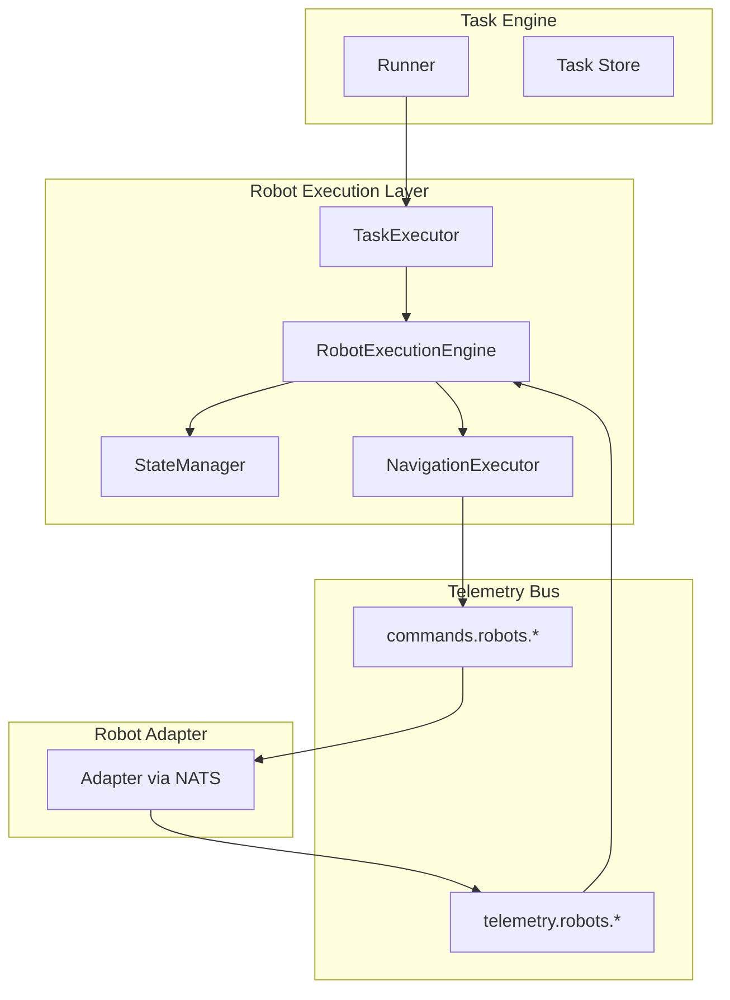
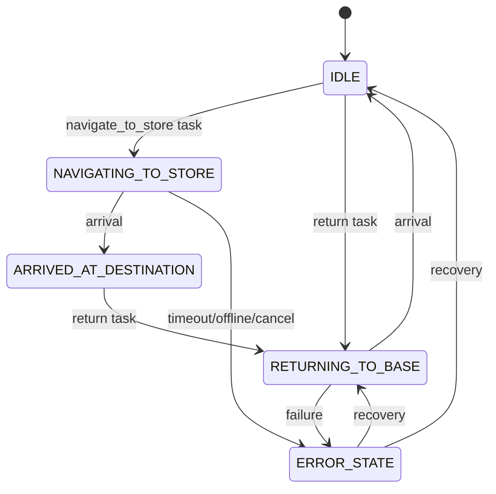

# Robot Execution Layer Architecture

## Overview

The Robot Execution Layer is the runtime controller for robot tasks. It sits between the Task Engine, Robot Adapter, and Telemetry Bus, managing the robot state machine, executing navigation tasks with arrival detection, handling failures, and emitting lifecycle events.

## Architecture



**Data flow**: Task Engine delegates navigation tasks to Execution Engine → Engine transitions states → sends commands via Bus → monitors telemetry for arrival → updates task status and emits events.

## Components

### State Machine (`internal/robot/state_machine.go`)

- **RobotState** — IDLE, GREETING_VISITOR, PROCESSING_REQUEST, PLANNING_ROUTE, NAVIGATING_TO_STORE, ARRIVED_AT_DESTINATION, RETURNING_TO_BASE, ERROR_STATE
- **RobotContext** — RobotID, CurrentState, CurrentTaskID, TargetStore, DestinationNode, TargetCoords, StatusMessage
- **CanTransition** — validates state transitions

### State Manager (`internal/robot/state_manager.go`)

- Thread-safe per-robot context storage
- `Get`, `Set`, `Transition`, `GetOrCreate`, `List`

### Navigation Executor (`internal/robot/navigation_executor.go`)

- Sends `walk_mode` and `navigate_to` commands via bus
- Subscribes to telemetry for arrival detection
- Arrival condition: `distance_to_target < 1.0` meters (configurable)
- Fallback: timeout-based completion when adapter does not report DistanceToTarget

### Task Executor (`internal/robot/task_executor.go`)

- Routes `navigate_to_store` and `navigation` (return) tasks
- Parses payload and delegates to NavigationExecutor

### Execution Engine (`internal/robot/execution_engine.go`)

- Central orchestrator
- `ExecuteTaskEntry` — dispatches by scenario ID
- `ExecuteNavigateToStore` — transitions to NAVIGATING_TO_STORE, executes, handles result
- `ExecuteReturnToBase` — transitions to RETURNING_TO_BASE, executes, transitions to IDLE on arrival

## State Machine Diagram



## Integration Points

| Component | Integration |
|-----------|-------------|
| Task Engine | Runner delegates `navigate_to_store` and `navigation` (return) to Execution Engine |
| Telemetry Bus | Engine subscribes for arrival detection; publishes commands |
| HAL Telemetry | Optional `Position`, `TargetPosition`, `DistanceToTarget` for adapters |
| Arbiter | All commands pass through `SafetyAllow` before publish |
| Event Broadcaster | Engine emits lifecycle events |

## Event Catalog

| Event | Payload |
|-------|---------|
| robot_state_changed | robot_id, state, previous_state, task_id, timestamp |
| navigation_started | robot_id, task_id, destination, target_store, timestamp |
| navigation_progress | robot_id, task_id, distance_remaining, timestamp |
| navigation_completed | robot_id, task_id, destination, timestamp |
| navigation_failed | robot_id, task_id, reason, timestamp |
| robot_returning_to_base | robot_id, task_id, timestamp |
| robot_idle | robot_id, timestamp |

## API Endpoint

### GET /v1/robots/{robot_id}/state

Returns robot execution state.

**Response**:
```json
{
  "robot_id": "x1-001",
  "state": "NAVIGATING_TO_STORE",
  "current_task": "task-uuid",
  "destination": "10.5,20.3,0",
  "target_store": "Nike",
  "status_message": "navigating"
}
```

## Error Handling

| Failure | Action |
|---------|--------|
| Navigation timeout | Transition to ERROR_STATE, emit navigation_failed, update task failed |
| Robot offline | Transition to ERROR_STATE |
| Task aborted/cancelled | Transition to IDLE or ERROR_STATE, send safe_stop |
| Safety stop / release_control | Respect immediately; transition to ERROR_STATE or IDLE |

**Recovery**: ERROR_STATE → RETURNING_TO_BASE (attempt return) or ERROR_STATE → IDLE (reset).

## Mall Assistant Flow

1. Operator starts Mall Assistant → Handler greets, waits for request
2. Visitor requests store → Handler resolves store, plans route
3. Handler creates `navigate_to_store` task → Runner delegates to Execution Engine
4. Engine: IDLE → NAVIGATING_TO_STORE, sends commands, monitors telemetry
5. On arrival: NAVIGATING_TO_STORE → ARRIVED_AT_DESTINATION
6. Handler speaks arrival, creates return task
7. Engine: ARRIVED_AT_DESTINATION → RETURNING_TO_BASE, executes return
8. On arrival at base: RETURNING_TO_BASE → IDLE

## Related Documents

- [Mall Assistant Scenario](../implementation/mall-assistant-scenario.md)
- [Mall Digital Twin](mall-digital-twin.md)
- [Platform Architecture](platform-architecture.md)
