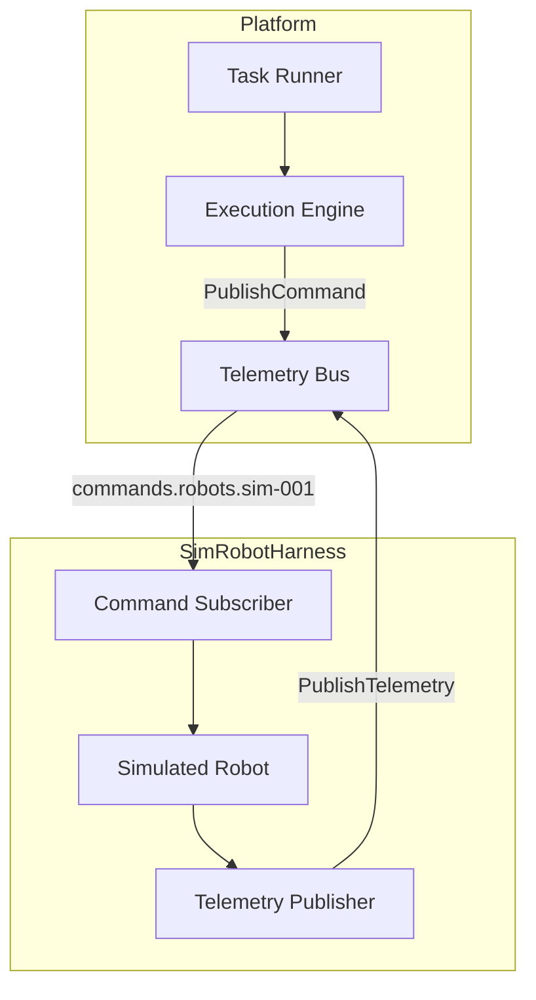

# Simulated Robot Harness

## Overview

The Simulated Robot Harness provides a virtual robot-in-the-loop runtime for SAI AUROSY. It allows end-to-end validation of the platform without physical hardware, including the Mall Assistant scenario, task execution, telemetry processing, and safety handling.

## Purpose

- Validate scenario flow without real robots
- Test task execution and the execution engine
- Verify telemetry processing and operator console state
- Exercise event emission and safety handling
- Enable deterministic, replayable testing

## Architecture

The simulator acts as a **virtual adapter** that:

- Subscribes to `commands.robots.{robot_id}` (same as real adapters)
- Publishes to `telemetry.robots.{robot_id}` (same format as `hal.Telemetry`)
- Registers robots in Fleet Registry with prefix `sim-`
- Does NOT implement `RobotAdapter` (which connects to real robot runtimes)



## Robot ID Convention

| Prefix | Description |
|-------|-------------|
| `sim-` | Simulated robot (e.g. `sim-001`) |

## Supported Commands

| Command | Description |
|---------|-------------|
| `navigate_to` | Start navigation toward target coordinates |
| `safe_stop` | Emergency stop; robot enters safe_stop mode |
| `release_control` | Release platform control |
| `walk_mode` | Enter walking mode |
| `stand_mode` | Enter standing mode |
| `speak` | Store text for observability |

## Simulation Model

### Robot State

- **Mode**: idle, navigating, arrived, returning_to_base, safe_stop, error
- **Position**: X, Y coordinates
- **Target position**: From navigation command
- **Distance to target**: Euclidean distance; arrival when < 0.5m
- **Speed**: 1 m/s (configurable)

### Movement

- Deterministic: no randomness; fixed speed and tick interval (500ms)
- Linear movement toward target coordinates
- Arrival detected when `distance_to_target < 0.5m`

## Failure Injection

Configurable failure scenarios (not random):

| Failure Type | Description |
|--------------|-------------|
| `navigation_timeout` | Never arrives; distance stays high |
| `offline_mid_route` | Robot goes offline during navigation |
| `safe_stop_mid_route` | Triggers safe_stop during navigation |
| `battery_low` | Sets battery level low |
| `command_rejected` | Simulates command rejection |
| `delayed_arrival` | Slowdown for N ticks |

### Trigger Conditions

- `after_ticks`: Trigger after N telemetry ticks
- `when_distance_lt`: Trigger when distance < X meters
- `after_command`: Trigger after receiving a specific command

## Replay Support

Deterministic replay from JSON scripts:

```json
{
  "scenario": "mall_assistant_happy_path",
  "ticks": [
    { "position": {"x": 0, "y": 0}, "distance_to_target": 30, "online": true },
    { "position": {"x": 2, "y": 0}, "distance_to_target": 28, "online": true }
  ]
}
```

Use `simrobot.LoadReplayScript(path)` and `simrobot.RunReplay(robot, script, tickInterval)`.

## REST API

When `SIMROBOT_ENABLED=true` (default):

| Method | Endpoint | Description |
|--------|----------|-------------|
| POST | `/v1/simrobots` | Create simulated robot |
| POST | `/v1/simrobots/{robot_id}/start` | Start simulation |
| POST | `/v1/simrobots/{robot_id}/stop` | Stop simulation |
| POST | `/v1/simrobots/{robot_id}/reset` | Reset to idle |
| POST | `/v1/simrobots/{robot_id}/inject-failure` | Inject failure scenario |
| GET | `/v1/simrobots/{robot_id}/state` | Get current state |

## Configuration

- `SIMROBOT_ENABLED`: Set to `false` to disable. Default: enabled when `WORKFORCE_REMOTE` is false.
- Default robot: `sim-001` is created and started automatically.

## Run and Validate

1. Start platform: `docker compose up -d`
2. Start Control Plane: `go run ./cmd/control-plane`
3. E2E flow:
   - Start Mall Assistant scenario for `sim-001`
   - Submit visitor request: "Where is Nike?"
   - Simulator receives `navigate_to`, moves, publishes telemetry
   - NavigationExecutor detects arrival
   - Return-to-base task created

## Related Documents

- [Integration Analysis](../implementation/simrobot-integration-analysis.md) — Step 1: HAL, task runner, execution engine analysis
- [Minimal Design](../implementation/simrobot-minimal-design.md) — Step 2: Minimal integration design
- [Adapter Layer](adapter-layer.md)
- [Platform Architecture](platform-architecture.md)
- [Mall Assistant Scenario](../implementation/mall-assistant-scenario.md)
