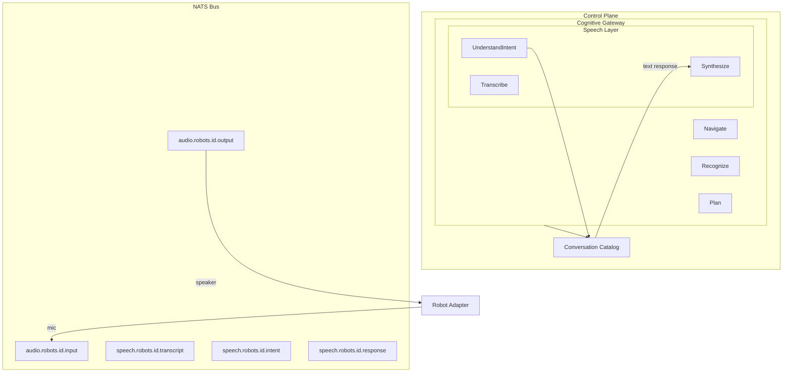

# Speech Layer Architecture

## Overview

The Speech Layer is part of the Cognitive Gateway in the SAI AUROSY Control Plane. It enables robots to understand human speech, detect language, extract intent, and respond with natural voice. The layer is vendor-agnostic and supports multiple speech providers (ElevenLabs, Azure Speech Services).

## Architecture

## Entry Points

- **REST** — `POST /v1/cognitive/process-audio` (body: `robot_id`, `audio_base64`). Runs the full pipeline and returns transcript, intent, response, and TTS audio. Used by Operator Console Speech Test.
- **NATS** — Subscribes to `audio.robots.*.input`. When adapters publish raw audio from the robot microphone, the pipeline runs and publishes TTS to `audio.robots.{id}.output`.

## Pipeline Flow

1. **Audio Input** — Robot microphone streams audio to `audio.robots.{id}.input`
2. **Speech-to-Text (STT)** — Cognitive Gateway `Transcribe` converts audio to text
3. **Language Detection** — STT result includes detected language (uz, en, ru, az, ar)
4. **Intent Extraction** — Cognitive Gateway `UnderstandIntent` extracts structured intent via LLM
5. **Conversation Catalog** — Lookup intent-to-response mapping (separate from motion scenarios)
6. **Response Resolution** — Fill template with intent parameters (e.g. `{{brand}}` -> "Nike")
7. **Text-to-Speech (TTS)** — Cognitive Gateway `Synthesize` generates audio
8. **Audio Output** — Publish to `audio.robots.{id}.output` for robot speaker

## NATS Topics

| Topic | Direction | Description |
|-------|-----------|-------------|
| `audio.robots.{id}.input` | Adapter → Platform | Raw audio from robot microphone |
| `audio.robots.{id}.output` | Platform → Adapter | TTS audio for robot speaker |
| `speech.robots.{id}.transcript` | Platform | STT result (observability) |
| `speech.robots.{id}.intent` | Platform | Extracted intent (observability) |
| `speech.robots.{id}.response` | Platform | Text response (observability) |

## Conversation Catalog

The Conversation Catalog is **separate from motion scenarios**. It maps intents (e.g. `find_store`) to response templates. Motion scenarios (patrol, navigation) are created by different developers and remain in the Scenario Catalog.

- **Intent** — e.g. `find_store`
- **ResponseTemplate** — e.g. `"{{brand}} store is on the {{floor}} floor"`
- **SupportedLanguages** — uz, en, ru, az, ar
- **Tenant isolation** — tenant-specific conversations override shared ones

## Supported Languages

- **Tier 1**: Uzbek (uz), English (en), Russian (ru)
- **Tier 2**: Azerbaijani (az), Arabic (ar)

## Capabilities

Robots with microphone and speaker declare the `speech` capability in the Fleet Registry. See [Robot Adapter Contract](../adapters/robot-adapter-contract.md).

## Related Documents

- [Cognitive Gateway](cognitive-gateway.md)
- [Phase 3.5 Speech Layer](../implementation/phase-3.5-speech-layer.md)
- [Platform Architecture](platform-architecture.md)
