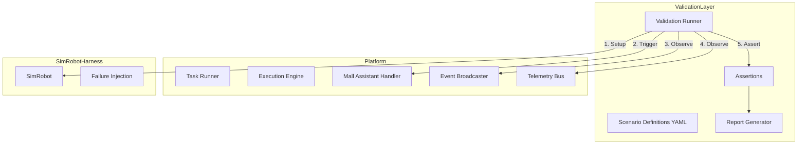

# Validation Layer

## Overview

The validation layer provides deterministic validation of the SAI AUROSY platform against the Mall Assistant pilot scenario.

It answers:

- Does the platform reliably support the full Mall Assistant flow?
- Does the platform correctly handle common failure cases?
- What exact contract must a real robot adapter satisfy?
- Is the platform ready for live robot integration?

## Architecture



## Components

| Component | Location | Purpose |
|-----------|----------|---------|
| Types | `internal/validation/types.go` | Scenario, Assertion, Report, ValidationContext |
| Scenario Loader | `internal/validation/scenario.go` | Load YAML scenario definitions |
| Assertions | `internal/validation/assertions.go`, `event_checks.go`, `state_checks.go`, `telemetry_checks.go` | Assertion evaluation |
| Runner | `internal/validation/runner.go` | Orchestrates setup, execution, observation, assertion |
| Report | `internal/validation/report.go` | JSON and Markdown report generation |
| Adapter Contract | `internal/validation/adapter_contract.go` | Programmatic contract checks |
| CLI | `cmd/validation/main.go` | Entrypoint to run validation scenarios |

## Validation Scenarios

| Scenario | File | Description |
|----------|------|-------------|
| happy_path | `happy_path.yaml` | Full Mall Assistant flow: Nike, navigate, return, IDLE |
| unknown_store | `unknown_store.yaml` | Unknown store: no navigation task, graceful completion |
| offline_before_task | `offline_before_task.yaml` | Robot offline before nav → task fails cleanly |
| offline_mid_route | `offline_mid_route.yaml` | Robot goes offline during navigation → failure path |
| safe_stop_mid_route | `safe_stop_mid_route.yaml` | Safe stop during navigation → movement halt |
| navigation_timeout | `navigation_timeout.yaml` | Robot never arrives → timeout failure path |
| delayed_arrival | `delayed_arrival.yaml` | Slow arrival → still succeeds |
| return_to_base | `return_to_base.yaml` | Return path succeeds, robot ends in IDLE |
| repeated_request | `repeated_request.yaml` | Second request while busy → defined behavior |
| manual_override | `manual_override.yaml` | Operator safe_stop during nav → priority model |

## Assertion Types

| Type | Description |
|------|-------------|
| `final_robot_state` | Robot ends in expected state (IDLE, ERROR_STATE) |
| `task_status` | Task has expected status (completed, failed, cancelled) |
| `event_sequence` | Events emitted in expected order |
| `event_present` | Specific event type emitted |
| `no_navigation_task_created` | No navigate_to_store task (unknown store) |
| `telemetry_field_present` | Required telemetry field present |
| `telemetry_progression` | distance_to_target decreases over time |
| `timeout_triggered` | Task failed with timeout |
| `safe_stop_received` | Safe stop observed |
| `robot_offline_causes_failure` | Task failed with robot offline |

## How to Run

### Prerequisites

1. **NATS** must be running (e.g. `docker compose up -d` or `nats-server`).
2. **Working directory** should be the project root.

### Run All Scenarios

```bash
go run ./cmd/validation
```

### Run Single Scenario

```bash
go run ./cmd/validation -scenario happy_path
```

### Options

| Flag | Default | Description |
|------|---------|-------------|
| `-scenario` | (empty) | Run single scenario by name |
| `-scenario-dir` | `testdata/validation` | Scenario YAML directory |
| `-output-dir` | `outputs/validation` | Output directory for reports |
| `-contract-check` | false | Run adapter contract validation after each scenario |
| `-output-contract` | (empty) | Write adapter contract JSON to path and exit (e.g. `outputs/validation/adapter_contract.json`) |

### Output

- **JSON reports**: `outputs/validation/{scenario_name}.json`
- **Markdown reports**: `outputs/validation/{scenario_name}.md`
- **Summary**: `outputs/validation/summary.md` (when running all)

### Example Report (JSON)

```json
{
  "scenario_name": "happy_path",
  "status": "PASS",
  "start_time": "2025-03-10T12:00:00Z",
  "end_time": "2025-03-10T12:01:30Z",
  "duration_ms": 90000,
  "assertions_passed": 4,
  "assertions_failed": 0,
  "final_robot_state": "IDLE",
  "emitted_events": [...],
  "results": [...]
}
```

## Adapter Readiness Contract

See [Adapter Readiness Contract](../contracts/adapter-readiness-contract.md) and [Adapter Validation Checklist](../contracts/adapter-validation-checklist.md) for the formal contract.

## Related Documents

- [Simulated Robot Harness](simulated-robot-harness.md)
- [Adapter Layer](adapter-layer.md)
- [Mall Assistant Scenario](../implementation/mall-assistant-scenario.md)
