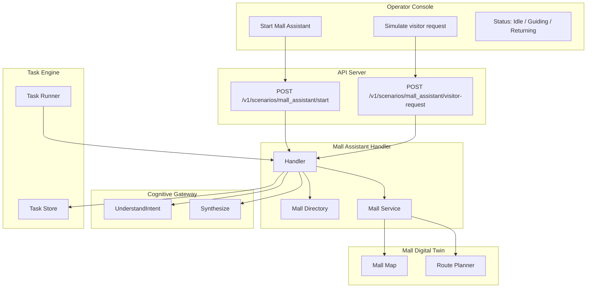

# Mall Assistant & Guide Scenario

## Overview

The Mall Assistant scenario is the first end-to-end interactive scenario for SAI AUROSY. It enables a humanoid robot to act as an interactive assistant in a shopping mall: greeting visitors, answering store-location questions, guiding visitors to stores, and returning to standby.

## Architecture



## Components

### Mall Directory (`internal/mall/directory.go`)

- **Store** struct: `Name`, `Floor`, `Zone`, `Coordinates`
- **FindStore(name string)** — in-memory lookup, case-insensitive
- Seed data: Nike, Adidas, Electronics Zone, Food Court

### Mall Digital Twin (`internal/mall/`)

- **MallMap** — domain model with floors, nodes, edges, store locations, base point
- **Service** — GetMallMap, FindStoreNode, GetBasePoint, CalculateRoute, ListStores
- **Route Planner** — Dijkstra shortest-path on navigation graph
- **Memory Repository** — loads from `scenarios/data/mall_map.json`
- See [Mall Digital Twin Architecture](../architecture/mall-digital-twin.md)

### Mall Assistant Handler (`pkg/control-plane/mallassistant/handler.go`)

- **VisitorRequestRegistry** — routes visitor requests to active handlers per robot
- **Handler** — runs the scenario: greet → wait for request → process → navigate → speak → return
- Integrates with Mall Service (route planning), Cognitive Gateway (UnderstandIntent, Synthesize), Task Store, Event Broadcaster

### Scenario Catalog

- **mall_assistant** — interactive scenario (delegated to handler, no step execution)
- **navigate_to_store** — walk_mode + navigate_to command with target_coordinates

### Intent Recognition (Mock Gateway)

- Keywords: nike, adidas, store, shop, food, restaurant, electronics
- Maps to `intent: find_store`, `parameters: { store_name }`
- Extracts store name from phrases like "Where is Nike?", "I want electronics"

### Telemetry Events

- `visitor_interaction_started`
- `mall_store_resolved` — store name mapped to node (mall_id, store_name, node_id)
- `mall_route_calculated` — route computed (mall_id, from_node, to_node, route_length, estimated_distance)
- `mall_navigation_requested` — navigate task created (mall_id, robot_id, store_name, from_node, to_node, route_length, estimated_distance)
- `navigation_started`
- `navigation_completed`
- `visitor_interaction_finished`

## API Endpoints

### Mall Assistant

| Method | Path | Description |
|--------|------|--------------|
| POST | /v1/scenarios/mall_assistant/start | Start Mall Assistant scenario for a robot |
| POST | /v1/scenarios/mall_assistant/visitor-request | Submit visitor request (simulate visitor speech) |

### Mall Digital Twin

| Method | Path | Description |
|--------|------|--------------|
| GET | /v1/malls/{mall_id}/map | Get full mall map |
| GET | /v1/malls/{mall_id}/stores | List store locations |
| GET | /v1/malls/{mall_id}/stores/{store_name} | Get store by name with node |
| GET | /v1/malls/{mall_id}/route?from={node_id}&to={node_id} | Calculate route between nodes |

### Start Request

```json
{
  "robot_id": "x1-001",
  "operator_id": "console"
}
```

### Visitor Request

```json
{
  "robot_id": "x1-001",
  "text": "Where is Nike?"
}
```

## Operator Console

- **Start Mall Assistant** button — starts the scenario for the selected robot
- **Status badge** — Idle | Guiding Visitor | Returning to Base
- **Simulate visitor request** — text input + Send button when scenario is active

## End-to-End Flow

1. Operator clicks "Start Mall Assistant" on a robot card.
2. Task is created (pending). Task Runner picks it up, delegates to MallAssistantHandler.
3. Handler emits `visitor_interaction_started`, speaks greeting.
4. Operator (or visitor) sends `POST /v1/scenarios/mall_assistant/visitor-request` with text e.g. "Where is Nike?".
5. Handler: UnderstandIntent → find_store, store_name: Nike. FindStore("Nike") → Store.
6. Handler: MallService.FindStoreNode → NavNode, GetBasePoint → base, CalculateRoute → route, distance. Emits `mall_store_resolved`, `mall_route_calculated`.
7. Handler emits `navigation_started`, speaks "Follow me. I will guide you to Nike."
8. Handler creates `navigate_to_store` task with extended payload (mall_id, destination_node_id, route, estimated_distance, target_coordinates). Emits `mall_navigation_requested`. Task Runner executes it (walk_mode → navigate_to).
9. On completion: Handler emits `navigation_completed`, speaks "We have arrived. Nike is here."
10. Handler emits `visitor_interaction_finished`, creates return task (navigation to base point).
11. Task marked completed.

## Constraints

- One robot, one location for MVP
- Visitor input via API (voice can be added later via Speech Pipeline)
- Mall directory is in-memory; can be extended to database
- Adapters may need to implement `navigate_to` command for real navigation

## Related Documents

- [Mall Digital Twin Architecture](../architecture/mall-digital-twin.md)
- [Phase 2.2 Task Engine](phase-2.2-task-engine.md)
- [Cognitive Gateway](../architecture/cognitive-gateway.md)
- [Platform Architecture](../architecture/platform-architecture.md)
