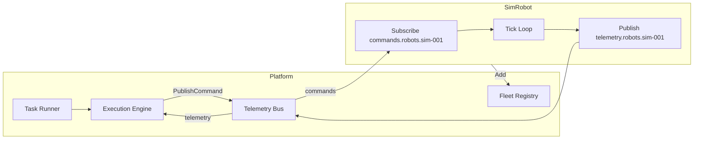

# Step 2: Simulated Robot Harness V1 — Minimal Integration Design

## Design Principles

- **No redesign:** Reuse existing HAL, Telemetry Bus, Fleet Registry
- **Minimal invasive changes:** Add `internal/simrobot/`; wire in `main.go` only
- **Virtual adapter pattern:** Subscribe to commands, publish telemetry — same contract as real adapters

---

## Architecture



---

## File Layout

```
internal/simrobot/
  types.go         # SimState, SimMode, FailureConfig, ReplayScript
  robot.go         # SimRobot, NewSimRobot, Start, Stop, Reset
  telemetry.go     # BuildTelemetry(robot) -> hal.Telemetry
  command_handler.go # HandleCommand(robot, cmd)
  simulator.go     # Tick(robot) — movement, arrival, publish
  failures.go      # applyFailure() — configurable injection
  replay.go        # LoadReplayScript, RunReplay
  service.go       # SimRobotService — create, start, stop, inject
  scenarios.go     # Predefined FailureConfigs (optional)
```

---

## Data Flow

1. **Command in:** `bus.SubscribeCommands(robotID, ...)` → `HandleCommand(robot, cmd)` → update `robot.state`
2. **Tick:** Every 500ms, `Tick(robot)` → check failure → move toward target → `bus.PublishTelemetry(BuildTelemetry(robot))`
3. **Arrival:** When `distance < 0.5m`, set `mode=arrived`, `distance_to_target=0`
4. **Registry:** `NewSimRobot()` calls `reg.Add(&hal.Robot{...})` before returning

---

## Integration in main.go

```go
// When SIMROBOT_ENABLED != "false" and !workforceRemote:
simService := simrobot.NewSimRobotService(bus, reg)
simService.CreateRobot(simrobot.CreateRobotOpts{RobotID: "sim-001", TenantID: "default"})
simService.Start(ctx, "sim-001")
// Pass simService to API server for REST (optional)
```

---

## Key Decisions

| Decision | Rationale |
|----------|-----------|
| No RobotAdapter impl | Simulator has no "connection"; it's in-process. Real adapters connect to robot runtime. |
| Linear movement only (V1) | Route nodes in payload not yet used; keeps implementation minimal. |
| Arrival threshold 0.5m | NavigationExecutor uses 1.0m; 0.5m ensures we cross threshold. |
| 500ms tick | Matches NavigationExecutor poll; deterministic. |
| robot_id prefix `sim-` | Per adapter-layer convention; distinguishes from x1-, go2-, ros-. |
